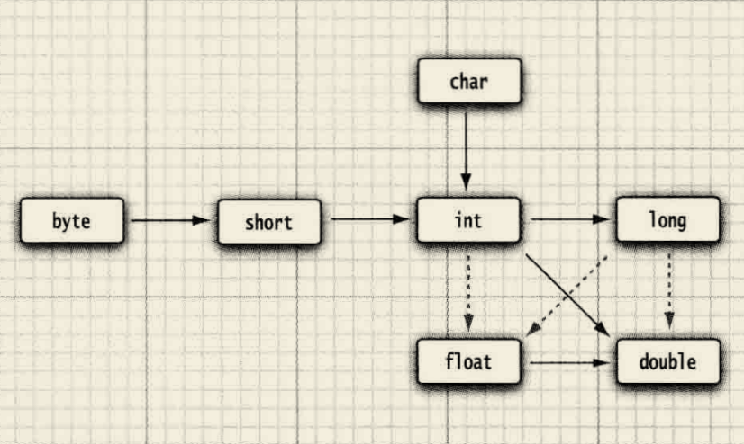
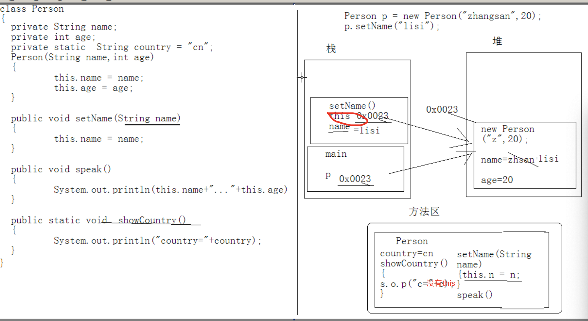
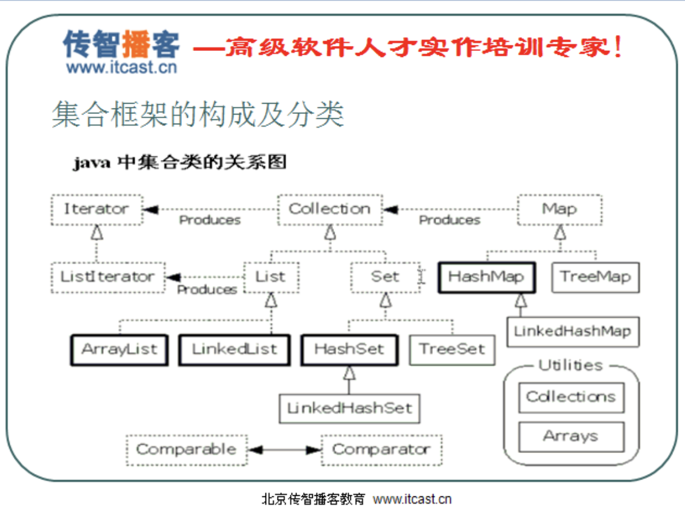

# java基础知识

## 基本数据类型

1. 6种数字类型 ：byte、short、int、long、float、double
2. 1种字符类型：char 
3. 1种布尔型：boolean

这八种基本类型都有对应的包装类分别为：Byte、Short、Integer、Long、Float、Double、Character、Boolean

| 基本类型 | 位数 | 字节 | 默认值  |
| :------- | :--- | :--- | ------- |
| int      | 32   | 4    | 0       |
| short    | 16   | 2    | 0       |
| long     | 64   | 8    | 0L      |
| byte     | 8    | 1    | 0       |
| char     | 16   | 2    | 'u0000' |
| float    | 32   | 4    | 0f      |
| double   | 64   | 8    | 0d      |
| boolean  | 1    |      | false   |

对于boolean，官方文档未明确定义，它依赖于 JVM 厂商的具体实现。逻辑上理解是占用 1位，但是实际中会考虑计算机高效存储因素。

注意：

1. Java 里使用 long 类型的数据一定要在数值后面加上 **L**，否则将作为整型解析：
2. `char a = 'h'`char :单引号，`String a = "hello"` :双引号

## 常量

利用关键字 final指示常量 例如 final double CM_PER_INCH=2.4

## 引用类型

## 数据比较


#### 1.3.2. 自动装箱与拆箱

- **装箱**：将基本类型用它们对应的引用类型包装起来；
- **拆箱**：将包装类型转换为基本数据类型；


   1. [基本数据类型](https://github.com/Snailclimb/JavaGuide/blob/master/docs/java/Java%E5%9F%BA%E7%A1%80%E7%9F%A5%E8%AF%86.md#13-%E5%9F%BA%E6%9C%AC%E6%95%B0%E6%8D%AE%E7%B1%BB%E5%9E%8B)
   2. [字符和字符串](https://github.com/Snailclimb/JavaGuide/blob/master/docs/java/Java%E5%9F%BA%E7%A1%80%E7%9F%A5%E8%AF%86.md#12-java-%E8%AF%AD%E6%B3%95)
   3. [数据类型转换](https://blog.csdn.net/qq_31459039/article/details/79714738)
   
## 基本数据类型和类型转换

## 类型转换
### 数据类型之间的转换

如果两个操作数中有一个是double类型，另一个操作数就会转换为double类型。
•否则，如果其中一个操作数是 float 类型，另一个操作数将会转换为 float 类型。
•否则，如果其中一个操作数是 long类型，另一个操作数将会转换为 long类型。
•否则，两个操作数都将被转换为 int 类型。


## 数组

1. 数组只能存储统一类型
1. 定义一个数组的格式为：数据类型[] 数组名称;
2. 数组一定要初始化之后才可以使用。初始化是指：为数组在内存当中开辟内存空间，用来保存数据，并且设置默认值。没有初始化的数组无法使用。
3. 数组的初始化方式分成两种：
    * 动态初始化，指定长度
    * 静态初始化，指定内容

4. 动态初始化
         
数组的动态初始化是直接指定数组的长度，并且为数组中的每一个元素赋予一个默认值。
    
动态初始化的格式为：

   * `数据类型[] 数组名称 = new 数据类型[长度]`
   * `数组 = new 数据类型[长度]`

数组元素的默认值规则为：

整数默认为0，浮点数默认为0.0，字符默认为’\u0000’，布尔值默认为false，字符串等引用类型默认为null。
   
## 函数
### 函数重载

1. 方法重载：方法名称相同，但是参数列表不同。
2. 参数列表的不同包括： 1.参数的个数不同； 2.参数的类型不同； 3.参数的多类型顺序不同。
3. 重载与下列因素无关： 1.方法的返回值； 2.参数的名称。
4. 参数传递 1. 对于基本类型（以及string）来说，形参的操作不会影响实际参数
5. 对于引用类型（除了String）来说，形式参数的操作【会】影响实际参数。

## 面向对象
### 面向对象概念

   1. 面向对象是相对面向过程而言 
   2. 面向对象和面向过程都是一种思想 
   3. 面向过过程是功能行为
   4. 面型对象将功能封装进对象，强调了具备功能的对象
   5. 面向对象是基于面向过程的
   
三个基本特征  封装 继承 多态
  
  
### 变量和类之间的关系

成员变量和局部变量

1. 属性：对应类中的成员变量
2. 写在成员方法中变量是局部变量。

```js
class Persion {
    String name; // 成员变量 实例变量
    static String country = "cn";// 静态的成员变量 类变量

    public void show() {
        System.out.println(name + "::" + country);
    }

    public static void country() {// 静态方法只能访问静态成员
        System.out.println(country);
    }
}

```

3. 作用范围
    * 成员变量作用于整个类中
    * 局部变量作用局部范围内，如：函数内，语句内等，只在所属的区域有效。
4. 内存中的位置
    * 成员变量在内存中，以为对象的存在，才在内存中
    * 局部变量在栈内存中，作用的范围结束，变量空间会自动释放。
5. 生命
    * 成员变量随着对象的建立而建立，随着对象的消失而消失，存在于对象所在的堆内存中。
    * 局部变量没有默认初始化值



### 封装

是指隐藏对象的属性和细节，仅对外提供公共访问方式（这些修饰符是私有的表现形式）

* private 子类： 不读 不写
* protected 子类： 读 不写
* public 子类： 读 写
  
### 构造函数

构造函数调用this

类似于construction 用于给对象初始化
1. 函数于类名相同 
2. 每个类可以有一个或以上的构造函数
3. 构造器可以有0 个1 个或多个参数
4. 不用定义返回值 不可以写 return 
5. 构造器总是伴随着new 操作一起调用
  
当一个类中没有定义构造函数时候，那么系统会给该类加入一个空参数的构造函数，当定义了就没有
  
*注意：*
多个构造函数是以重载的形式存在的
* 写法不同
* 运行不同
  
构造函数是在对象一建立就运行，给对象初始化，而一般方法是对象调用菜执行，给是对象添加具备的功能
  
### 构造代码块

作用：给对象进行初始化，对象一建立就运行，而且优先于构造函数执行
    
和构造函数的区别：
    
    构造代码块是给所有对象进行统一初始化（专有特征）不同对象共享的初始化内容
    
    而改造函数是给对应的对象初始化（共性特征）

### static 关键字

用法：用于修饰成员 成员变量成员函数 =》修饰之前（图1） 修饰之后 图2  特有内容在堆中，


修饰之前 country 在堆中


修饰之后 county 不在堆中，被单独提取出来了，在方法区（共享）（数据）


当成员被静态修饰后，就多了一个调用方法，除了可以被对象调用外，还可以被类名调用。 

`类名.静态成员`
  
1. 被修饰的成员以后具备以下特点：

   * 随着类的加载而加载，消失而消失: 说明周期很长
   * 优先于对象存在, 静态先存在，对象后存在
   * 被所有对象所共享
   * 可以直接被类名调用
  
2. 实例变量和类变量的区别
  
* 存放位置
    * 类变量随着类的加载而存在于方法区中
    * 实例变量随着对象的建立在堆内存中
* 声明周期
    * 类变量的声明周期最长
    * 实例变量的生命周期随着对象的消失而消失 
  
3.  静态使用注意

  1. 静态方法只能访问静态成员

       非静态访方法既可以访问静态也可以访问非静态
  2. 静态方法中不可以写this super 关键字
       
       因为静态优先于对象存在，所以静态方法中不可以出现this
  3. 主函数是静态的
  
#### 静态有利有弊端

  好处： 对象共享数据进项单独的空间存储，节约空间，没必要每个对象都存储一份

  弊端： 声明周期过长
  
#### 主函数

`public static void main(String[] args)`

主函数： 是一个特殊的函数，作为程序的入口，可以被jvm调用

主函数的定义： 
```
public: 代表改函数访问权限已经是最大
static: 代表该函数随着类的加载已经就存在了
void:  主函数没有具体的返回值
main: 被jvm 识别
jvm 在调用主函数的时候传入的是 new String(0)
```

#### 什么时候使用静态
  
  什么是静态？

  要从两方面下手,因为静态修饰的内容有成员变量和函数
  
  什么时候定义静态变量（类变量）呢

  当对象中出现共享数据时候，该数据被静态所修饰,当对象中特有数据要定义成静态存在于内存中
  
  什么时候定义静态函数呢

  当功能内部没有访问到非静态数据（对象的特有数据-那么改功能可以定义成静态
  
  虽然可以通过建立Array的对象使用这些工具方法,对数组进行操作，发现了问题
  
  1. 对象是用于封装数据的，可是ArratTool 对象并未封装特有的数据
  2. 操作数据的每一个方法都没用到ArrayTool 对象中的特有数据
  
  可以让Array static 静态化直接调用类名即可
  
  将方法都静态后，可以方便使用但是该类韩式可以被其他对象建立对象的，为了更加严谨，强制让该类不能见了对象 将构造函数私有化
  
  
####  静态代码块 
```
   格式
   static {
    静态代码块中执行语句
   }
```

  特点：随着类的加载而而执行，只执行一次，并优先于主函数，用于给类进行初始化。 无法访问非静态常量
   
   
#### 静态代码初始化过程
   
`Person p = new Persion("zhang",20)`
   
该句话都做了什么
   1. 因为new 用到了Persion.class 所以会找到Persion.class 文件并加载到内存中
   2. 执行该类中的static 代码块 如果有的话，给persion.class 类进行初始化
   3. 在堆内存中开辟空间，分配内存地址
   4. 在堆内存中建立对象的特有属性，并进行默认初始化
   5. 对属性进行显示初始化
   6. 对对象进行构造代码初始化
   7. 对对象进行对应的构造函数初始化
   8. 将内存地址付给栈内存中的p 变量。
   
 ## 继承
 ### 继承的概述
   提高了代码复用性
   让类和类之间产生关系，有了关系才有多态的特点。
   注意： 不要为了获取其他类的功能，简化代码而继承，必须是类和类之间有关系才继承，
         java 值支持单继承
  
  ## 子父类中变量的特点（super 关键字）
   子类出现后，类成员的特点：
   1.变量
   2.函数
   3.构造函数
   A:变量：
   如果子类中出现非私有的同名变量成员变量时候
   子类访问 使用this
   子类要访问父类中的同名变量用super/
  
  ## 函数覆盖
  当子类出现和父类一模一样的函数时， 当子类对象调动改函数，会运行子类函数的内容，如同父类函数被覆盖一样
  
  B:这种情况是函数重写（覆盖）
   
  1. 子类覆盖父类，必须保证子类的权限大于等于父类的权限，才可以覆盖，否则编译失败，并且一模一样，返回值一样，函数名一样
  2. 静态只能覆盖静态
  如果函数之前没有明确的标志，则类型是默认类型，是 public 和 protect之间
  子类中调用父类的构造函数，一定会调用super 一般函数调用 supee.fn()
  
  重载： 只看同名函数的参数列表
  重写： 覆盖
  
  ## 子类的实例化过程
  C:子类的构造函数
  
  在对子类对象进行初始化时，父类的构造函数也会运行
  那是因为子类的构造函数默认第一行有一条隐士的语句super()
  super 会访问父类的构造函数，位置为第一行
  
  为啥摸子类一定要访问父类中的构造函数
 
  ### 子类的实例化过程：
  1.子类中所有的的构造函数都会访问父类中的构造函数（super）
  2. 当父类中没有空参数的构造函数视乎，子类必须手动通过super语句形式来指定要访问父类中的构造函数
  3. 子类中的构造函数第一行也可以手动指定this 语句来访问本类中的构造函数，子类中至少有一个构造函数会访问父类中的构造函数
  
  ## final: 最终 作为一个修饰符
  1. 可以修饰 类 函数 变量
  2. 被final 修饰的类不可以继承，为了避免继承，被子类腹泻功能
  3. 被final 修饰的方法不可以被改写，
  4. 被final 修饰变量只能赋值一次，可以是一个常量，固定数据，通常为大写
  
  ## 抽象类 
  1. 抽象方法一定在抽象类中
  2. 抽象方法和抽象类都必须被abstract 关键字修饰
  3. 抽象方法不可以 用new
  4. 抽象类中的方法要被使用，必须有子类复写所有的抽象方法后，建立子类对象调用，如果子类覆盖了部分抽象方法，那么该子类 还是一抽象类
  
  ### 抽象类和一般类不同：
   正常描述事务，只不过是该事务出现了一些看不懂的东西。
   抽象只能描述方法，可以不定义抽象方法
  
  
  ## 接口（支持多继承）（但是java 值支持单继承）
  接口中的成员修饰符是固定的
       成员变量：  public static final
       成员函数： public abstract
   接口这接口之间是继承关系
       继承是所属关系，（集合的一种）
       接口是体系以外的功能扩展，（集合以外的扩展）
   接口特点
       1.接口是对外暴露规则
       2.接口是程序的功能扩展
       3.接口可以用来多实现
       4.类于接口之间是实现关系，而且类可以继承一个类的同时实现多个接口
       5.接口和接口之间可以有继承关系
  
  ## 模板方法：
  在定义功能的时候，功能的一部分是确定的， 但是有一部分的是不确定的，而确定的部分固定，不确定的部分暴露出去
  //TODO: 模板方法  
 
 ## 异常

  1. 对于严重的：java 通过Error 来进行描述 - 一般不进行处理
  2. 对于不严重的java 通过 Exception 进行描述- 可以进行针对性的处理
  3. 异常处理
  ```
  try{
  检测的代码
  }catch(变量){
   处理异常
  }
  finall{
  }
  ```
  对捕获的异常 对象 使用 String getMessage()
  
  
  ### throw 和 throws 的区别
  
  1. throws 使用在函数上
  2. throw 使用在函数内
  
  3. throws 后面跟的是异常类 可以跟对个 用逗号隔开 
  4. throw 跟的是异常对象


 ## string 类型
 
 字符串是一个特殊的对象
 
 字符串一旦初始化之后， 就不可以改变
 
 ### StringBuffer 字符串缓冲区(容器)

  字符串的组成原理就是通过该类实现的
 
 1. stringBuffer 是可变长度
 2. stringBuffer  可以存储不同的类型
 3. stringBuffer 最终转换为字符串使用
 4. 可以反转字符串 reverse()
 
 
 功能
 1. 添加： append()
 2. 插入： nsert(index data)
 3. 删除: delete(start end)  deleteCharAt(int findex) 删除指定位置元素
 4. 修改： replace(start end string )  
 5. 查找： char charAt(index)
 6. int indexof (string)
 7. int lastIndexof (string)
 8. gethashcode() 获取 
 
 
 


  
## 集合

  集合的特点：
  1. 用于存储对象的容器
  2. 集合的长度是可变的
  3. 不可以存储基本的数据类型, add的类型为Object 基本数据类型会被装箱
  
### collection 常见方法
  
  1. 添加
   * boolean add(Object obj)
   * boolean addAll(Collection coll)
  
  2. 删除
   * boolean remove(Object obj)
   * boolean removeAll(Collection coll)
   * void clear()
  
  3. 判断
   * boolean contains(object obj)
   * boolean containesAll(Collection coll)
   * void isEmpty()
  
  4. 获取
   * int size()
   * Iterator iterator(); 获取元素方式 迭代器
   * 该对象必须依赖于棘突容器，因为每一个容器的数据结构不同

  所以 该迭代器对象是在容器中进行内部实现的，对于使用容器者而言，具体的实现不重要 只要通过容器获取到该实现的迭代器对象即可
  
  一个事物直接访问另外一个事物内部类的成员
  
  5. 其他
  
  * boolean retainAll(Collection coll) 取交集
  * Object() toArray(): 将集合转换为数组
  
### list & set 

   * list--- 有序的 存入和取出的顺序一致，元素都有索引（角标） 元素可以重复
   * set --- 元素不能重发 无序
  
  
#### list 特有的方法， 可以操作角标 add 
  
  1. 添加
       void add(index, elemet)
       void add(index, collection)
  2. 删除
       Object remvoe(index)
  3. 修改
       Object set(index, element)
  4. 获取
       Object  get(index)
       int     indexOf(object)
       int     lastindexOf(object)
       List    subList(from, to)
  
#### List 

   * --- vector 内部数组数据结构  是同步的 增删 查询都很慢
   * --- ArrayList 内部是数组数据结构  是不同步的  代替了 vector  查询的速度快
   * --- LinkedList 内部是链表数据结构  是不哦同步的  增删元素的速度会很快
  
当基本类型变为Object 会进行封箱操作

  show(Object num)

  Object num = new Integer(6)
  
#### set
 
Set: 元素不可以重复，是无序 set 接口中的方式和collection是一致的. 

 * ------ hashSet: 内部数据结构是哈希表,是不同步的
 * -------------- LinkedHashSet: 有序的
 * ------ treeSet: 
  
##### hashSet
  
  哈希表确定元素是否相同, 
  1. 判断的是两个元素的哈希值是否相同，如果相同 在判断两个对象的内容是否相同
  2. 判断哈希值相同，其实判断的是对象hashcode 的方法，判断内容相同 用的是equals 方法
  *注意：*
   1. 如果哈希值不同， 是不需要判断equals 的。
   2. 如果元素要存储到hashset集合中，必须覆盖hashcode 方法和equals方法
   3. 如何和 arrayList 比较不同. arrayList 比较内容相同 直接测试equals
  
#### treeSet

可以对set 集合中的元素进行排序，是不同步的
    
判断元素唯一的方式吗， 就是根据比较方法的返回结果是否是0。是0 就是相同的元素，不存。
  
  * ---方法1 让元素具有比较功能， 实现 comparable 接口， 覆盖compareTO 方法
     
     如果不要按照对象中具备的自然顺序进行排序，怎么版
       
       可以使用treeset 集合第二种排序
  * ----方法二 让集合自身具备计较功能，定义一个实现comparator  接口 覆盖 compare 方法，将该类对象作为参数传递给 treeset 集合的构造函数
  
 * 看到array 就要想到数组， 需要 想到快速查询
 * 看到 link  就要想到 链表，就要想到增删块，  就要想到add get remove first last 方法
 * hash 哈希表， 想到唯一性， 就需要想到元素需要覆盖 hashcode 和 requals 方法
 * 看到 tree 就想打二叉树，想到排序，就想到连个接口 comparable Comparator
  
  这些常用的结合是不同步的

## Map 

map 一次添加一对元素， collection一次添加一个元素
map 也称为双列集合，  collection 集合称为双列集合
map 集合中存储的是键值对
map 集合中必须保证建值的唯一性

常用方法
  
  1. 添加 value  put(key, value) 返回前一个和key 关联的值， 如果没有返回null
  2. 删除
      * void clear() 清空map 集合
      * value remove(key): 根据指定的key 翻出的这个键值对
  3. 判断
   * boolean containsKey(key)
   * boolean containsValue(value)
   * boolean isEmpty();
  
  4. 获取
  
  * value get(key) 通过键获取值，如果没有该键返回null
  * 当然可以通过返回null, 来判断是否包含指定的jian
  * size 获取映射关系

## 容器

集合框架的构成和分类



#### 接口


## 调用关系


## 修饰符的权限


| l         | 同一个类 | 同一个包 | 不同包的子类 | 不同包的非子类 |
| :-------- | :------- |
| private   | V        |
| default   | V        | V        |
| protected | V        | V        | V            |
| public    | V        | V        |              | V              | V |